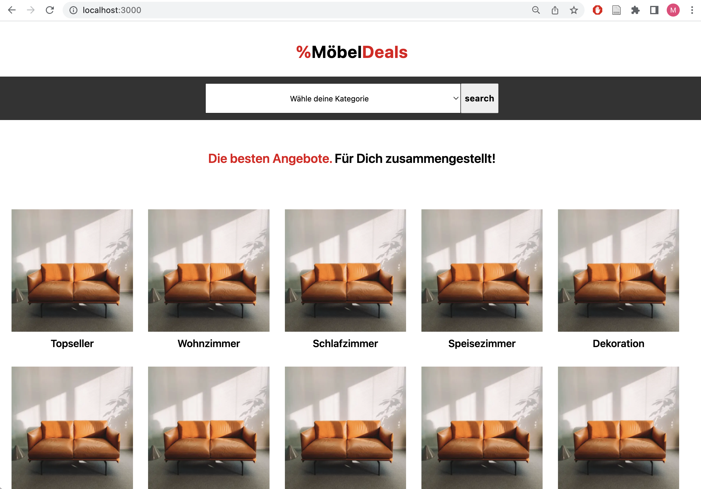
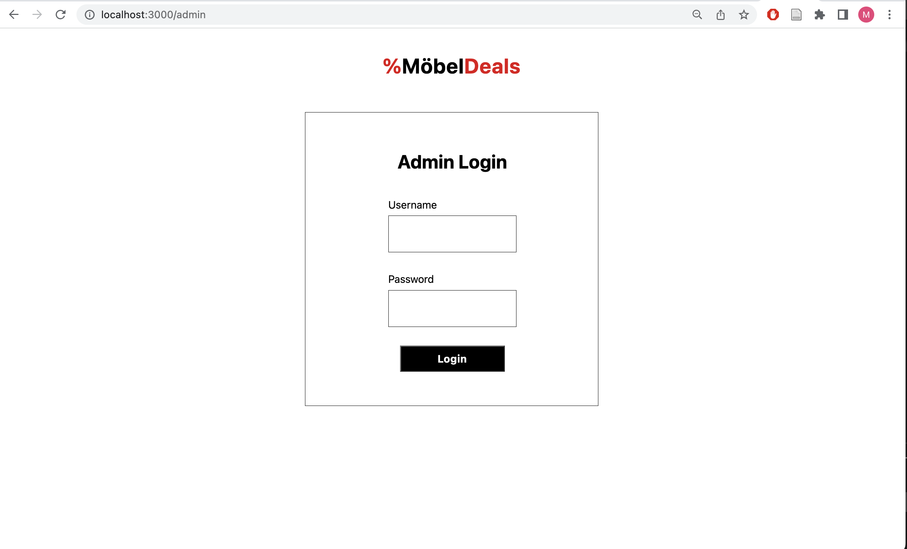

### Hot Deals Platform

This is a simple platform that manages the hottest deals available on three different Austrian furniture stores. A simple logo and name - %MöbelDeals - was created for this platform.

Users can filter deals based on categories. All deals are linked to the original product page, where users can get more information and purchase the product. Further, an admin login is provided where deals are reviewed and managed before they are published on the platform. Access the admin section via “\admin”, username: admin, pw: 123. Once you are logged in you have the option to retrieve hot deals via a dropdown selection field. Make your selection and submit your choice.

Once the deals are retrieved, they will be presented in a form for you to review. The form consists of 5 categories (product name, category, old price, current price, discount). With regards to categories: There are 12 product categories corresponding to the categories in the database.

Currently deals are extracted only for the following categories: 0: Topseller, 1: Wohnzimmer, 2: Schlafzimmer, 3: Speisezimmer, 4: Dekoration, 5: Arbeitszimmer, 6: Badezimmer, 7: Garderobe, 8: Kinderzimmer.

Note that it may happen that not all fields contain data, for example if no discount or list price is provided on the original website. Once you are done reviewing press “Save Products in DB”- button to save the deals in the database.

### Languages and Tools:

         

## Screenshot of the project

  

  

